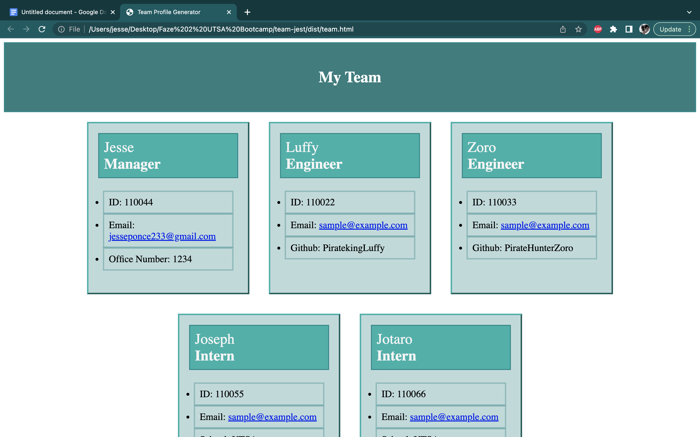

# team-jest

## Description 
This is a Team Info generator for the Module 11 challenge of the bootcamp. in this challenge, we were instructed to generate an HTML template using node.js. We would start with prompting questions for information on team members, once this has been done, the input is used to creat a webpage inlcuding cards with information on the team. 

## Usage
npm i Jest 
npm i Inquirer
## Links 

## Video Walkrhtough 
[team-jest](https://drive.google.com/file/d/1xgs44BLCK3sHw2rgSRJgSZIdJiqYJ7Kh/view)
